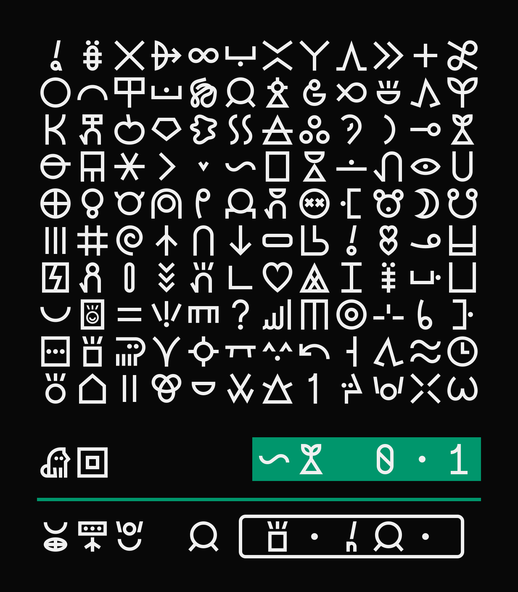

# linja laso
(laso pi mute ante li pali e linja ni e lipu ni)
### current version: 0.1

this is a little font i'm making, based on a grid and with sharp edges! More about [why](https://github.com/cvni1981/linja-laso/wiki/why) and {how}. (under construction!)

any and all quibbles may be sent to cvni1981@gmail.com

### currently has:
- nimi pu ale
- leko and kijetesantakalu
- cartouched glyphs and morae dots
- stackable versions of several glyphs

### will (hopefully soon) have:
- a wiki here to show how i made this font so other people can as well!
- add more stack glyphs (if they dont look too crappy with the thickness and grid)
    - including special ones as character variants, like kama pona, kama sona, toki pona
- make the letters not look too crappy
- scaling glyphs (same thing, if they dont look too bad when squished)
- lots and lots of character variants
- toki pona radicals
- personal glyphs (priority on those who Need them to be identified)
- proportional (non-monospaced) version!
- half thickness version!
