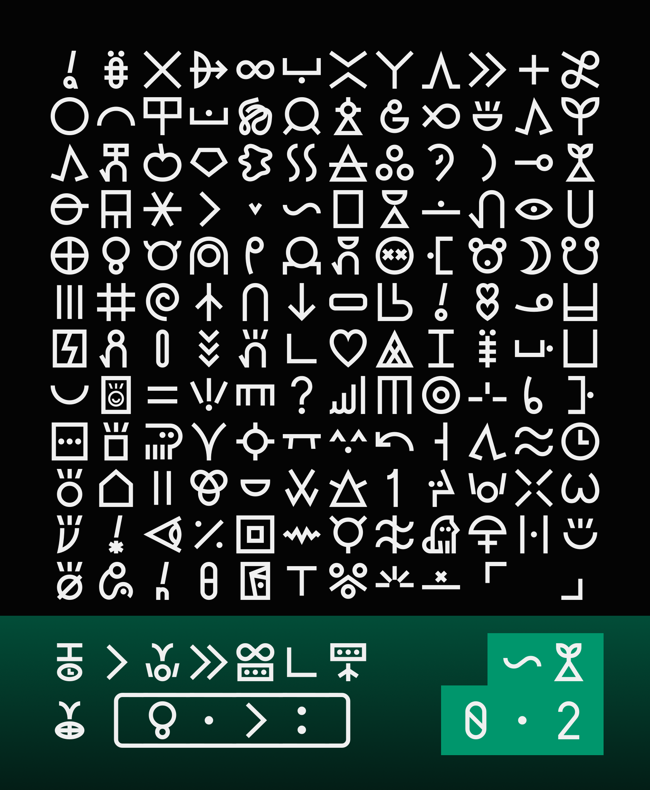

# linja laso
(laso pi mute ante li pali e linja ni e lipu ni)
### current version: 0.2

this is a little font i'm making, based on a grid and with sharp edges! More about [how](https://github.com/cvni1981/linja-laso/wiki). (under construction!)

any and all quibbles may be sent to cvni1981@gmail.com

### currently has:
- nimi pu ale, nimi ku suli ale
    - also the nimi ku lili in the UCSUR standard so all glyphs are included
- cartouched glyphs, morae dots, te and to quotation marks
- stackable versions of most glyphs (using `-`)

### will (hopefully soon) have:
- lots and lots of character variants
- personal glyphs (priority on those who Need them to be identified)
- more stack glyphs?
    - including special ones as character variants, like kama pona, kama sona, toki pona
- cartouche tickmarks
- make the letters not look too crappy
- toki pona radicals
- scaling glyphs (same thing, if they dont look too bad when squished)
- proportional (non-monospaced) version!
- half thickness version!
